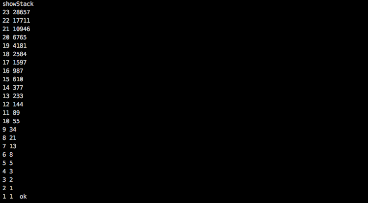

# Fibonacci-forth
The Fibonacci sequence using Forth language

I used GNU forth (https://www.gnu.org/software/gforth).

## Explainations

Forth is a stack based language. All functions are called words.

* `2dup` word duplicates `n` and `n-1` elements and put it on the top of the stack
* `+` word takes `n` and `n-1` elements from the stack and sum them. The results goes on top of the stack.

```forth
: fib ( -- x )
    2dup
    +
;
```

The `fib` word sums the two last elements and put the result on the top of the stack, which is the Fibonacci sequence.


